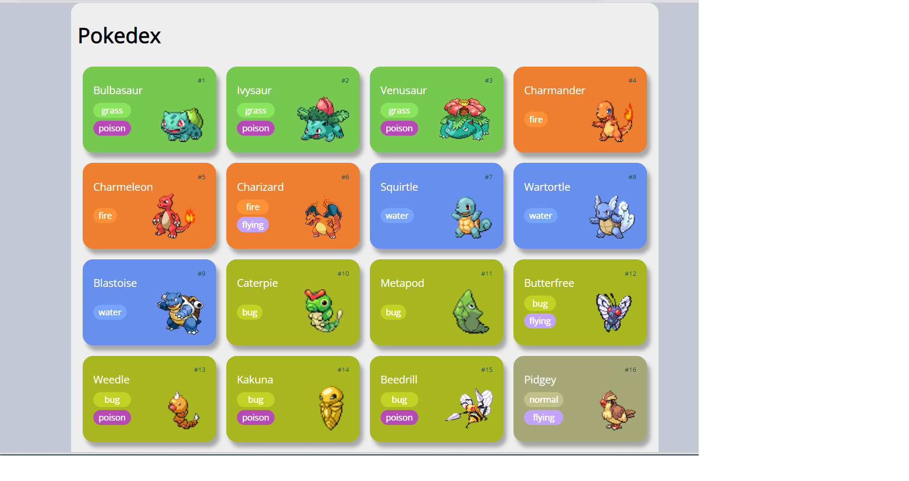
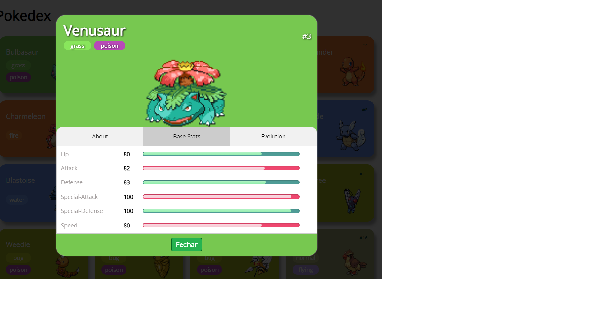

# Pokedex vanilla

Pequeno projeto pokedex desenvolvido no módulo "Dominando o Protocolo HTTP e Integrando com a PokeAPI" do curso da DIO, professor Renan Johannsen.

## Imagens projeto funcionando

## Home

## Pokemon details

# Referência da API

https://pokeapi.co/
